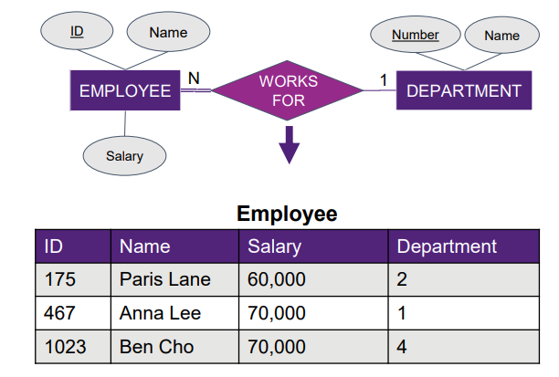
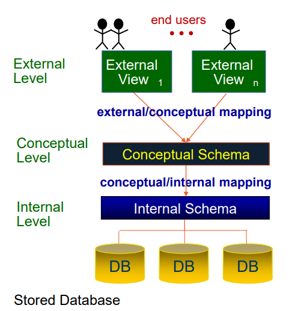

# Overview of Database Management Systems (DBMS)

## Data, Information, Systems
- Data: raw facts/statistics (digitized)
- Information: Data put into context to help people make decisions.
- System: interating components with a purpose
    - Examples: nervous system, legal system, banking system, education system …
- Information system: manages information for operations and decision-making: People + Data + Hardware + Software + Processes

## Database:
- Organized collection of related, meaningful data
- Models a mini-world / Universe of Discourse (UoD)
- Built for a specific purpose and users
- Can be small/large; manual or computerized 

## Database Management System (DBMS)
- It is a software used to define, construct, manipulate, and maintain databases.
- It can be general-purpose (business applications) or special-purpose, such as geographic or biological databases.

### Functions of a DBMS
- Enforces integrity constraints to maintain correct data.
- Processes queries and updates efficiently using languages such as SQL.
- Provides security to control access to data.
- Supports concurrency (sự đồng thời) control for safe multi-user access.
- Supports backup and recovery to handle failures.

## Database System Components
- A database system consists of the database, the DBMS, application programs, and users.
- Users include database administrators, designers, programmers, and end users.

## Database Design
1. Conceptual design identifies the Universe of Discourse and models it using a data model.
2. Design theory and normalization reduce redundancy and prevent inconsistencies.
3. Physical design determines storage structures, indexing, and access methods.

## Relational Data Model
- The relational model represents data as relations (tables).
- It enables mapping from conceptual models to relational schemas.
- It supports complex relationships among data.

## Three-Schema Architecture
- External level defines user views.
- Conceptual level defines the global logical structure of the database.
- Internal level defines physical storage.
- This separation hides storage details from users.

### Data Independence
- Logical data independence: allows changes to the conceptual schema without affecting user views or applications.
- Physical data independence: allows changes to storage without affecting the logical schema.