# Conceptual Data Modelling - The Entity-Relationship Model

## Conceptual Database Design
- Step 1: Identify the "Universe of Descourse" (UoD)
- Step 2: Convert the UoD to a data model, which can be captured by a database (only capture common and relevant phenomena, not all details)
- Usually represented using ER diagram.
- No conceptual model is perfect

## The Entity-Relationship (ER) Model
- Is a graphical technique to represent entities, attributes and relationships.
- It is used to analyze requirements and guide database design.

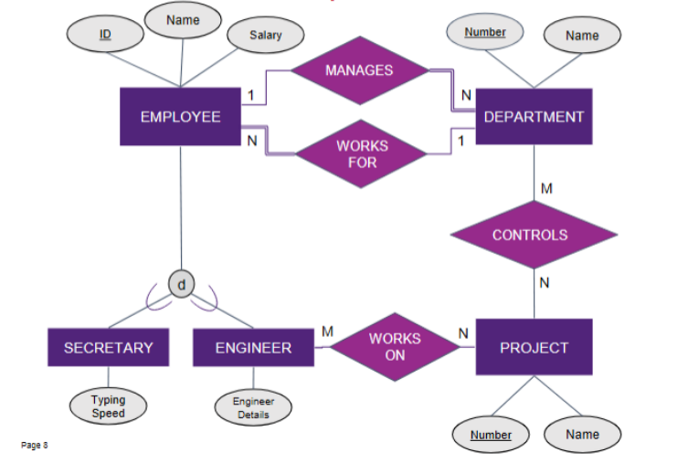

## Entities and Relationships

- **Entity**:
    - Is a real or conceptual object.
    - Each entity has attributes, which are the particular properties that describe it (Like employee e1 entity will have ID, Name, Salary attributes)
    - The same entity may have different prominence in different UoDs
- **Entity Type**:
    - Defines a set of similar entities. (E.g Employee)
    - Entities are drawn as rectangles.
- **Attributes**
    - Describe properties of entities and are drawn as ovals.
    - Key attributes uniquely identify entities and are underlined.
    - Multiple keys may exist for an entity type.

    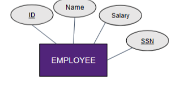

- **Composite vs Simple Attributes**
    - Composite attributes are attributes made of sub-attributes. Like Name can be divided into Fname, Mname, Lname
    - Simple attributes cannot be subdivided.

- **Several Attribute Keys**

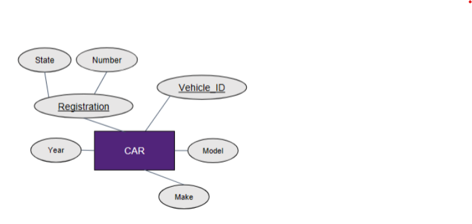

- **Single vs Multivalued Attributes**
    - Single-valued attributes have one value per entity.
    - Multi-valued attributes can have multiple values and use double ovals.
    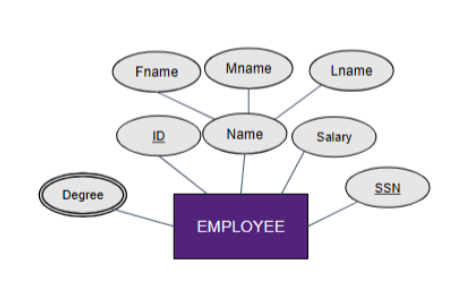

- **Stored vs derived Attributes**
    - Derived attributes are computed from other attributes and use dotted ovals.

    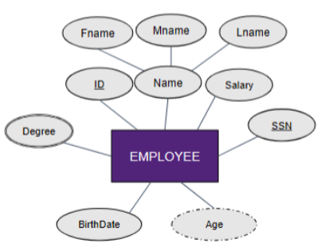

- **Value Sets of Attributes**
    - Define allowed attribute values but are not shown in ER diagrams. (E.g. employeeAge is an integers between 21 and 65)
    - Null values represent missing, unknown, or inapplicable data. (e.g. tertiaryDegree: not applicable for a person with no university education)

- **Entity Set**
    - Is the collection of all entities of an entity type at a given time.
    - Entity sets can be mapped to relations (tables).

    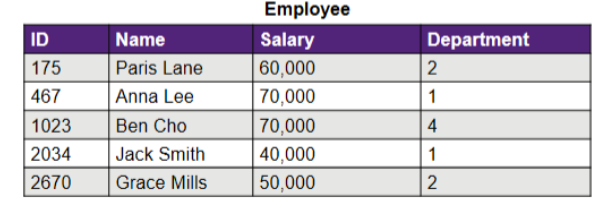

- **Relationship Types**
    - A relationship is an association among two or more entities.
    - Relationship types are drawn as diamonds.
    - Relationships may have decriptive attributes and keys.
    - 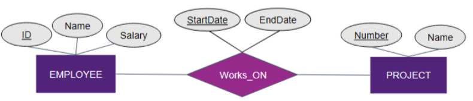
- **Relationship degree**
    - Is the number of participating entity types (binary(2), ternary(3), n-ary).
    - 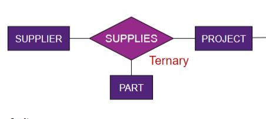

- **Entity Roles**: Entities participate in relationships under specific roles.

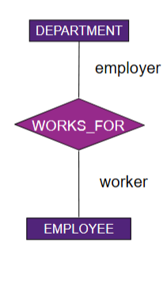

- **Recursive relationships** relate an entity type to itself. Same entity can participate more than once in the same relationship type under different "roles"

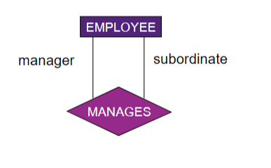

- **Relationship Set**
    - A relationship set is the collection of all relationship instances of a relationship type.

    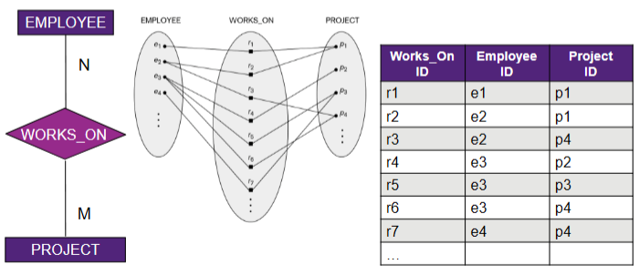

## Relationship Constraints
- Restrict valid entity combinations and come from the UoD.
- **Cardinality constraints and Participation constraints**
    - Cardinality constraints specify how many relationship instances an entity can participate in.
        - 1:1 means both sides at most one.
        - 1:N or N:1 means one side many, the other at most one.
        - M:N means both sides many.
    - Participation constraints specify whether participation is mandatory.
        - Total participation means every entity must participate and is shown with double lines.
        - Partial participation means participation is optional.
        - Existence dependency means an entity cannot exist without the relationship.

Weak entities have no full key of their own.
They are identified by a partial key plus the owner entity’s key.
Partial keys are shown with dashed underlines.
Identifying relationships use double diamonds.
Weak entities always have total participation in identifying relationships.

The Enhanced ER (EER) model introduces classes, superclasses, and subclasses.
Subclasses inherit attributes and relationships from superclasses.
Specialization creates subclasses based on distinguishing characteristics.
Generalization abstracts subclasses into a superclass.
Specialization can be total or partial.
Subclass sets can be disjoint or overlapping.

Design choices exist in conceptual modelling.
Attribute vs entity (or weak entity).
Attribute vs subclass.
Entity vs relationship.
Superclass vs subclass relationship.
Binary vs n-ary relationships.
Multiple ER diagrams may correctly model the same system with different trade-offs.